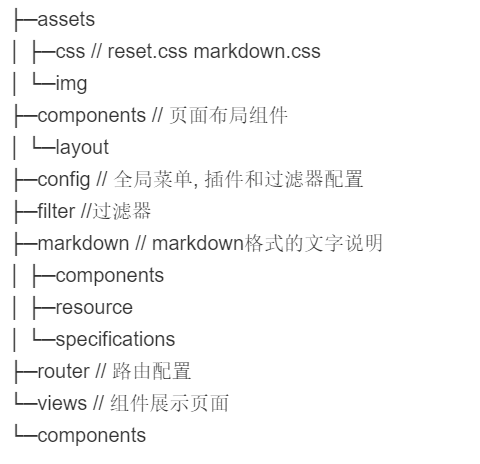
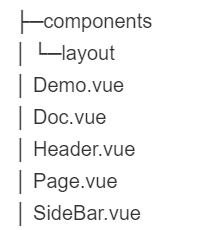

###  介绍
* 类似饿了么的组件库网站，有顶部和侧边导航，核心内容区包括文档和组件UI展示
* 组件文档区块说明由markdown格式编写

###  界面


###  目录结构


### 实现
1. 关于markdown 
**webpack配置** 为了让用vue-cli3搭建的工程支持markdown, 需要安装相关loader,然后手动增加webpack对markdown的处理,在原目录下新建vue.config.js, 此处不同于vue-cli2生成的模板里面已有webpack配置，cli3没有对外暴露webpack配置。
```javascript
module.exports = {
  chainWebpack: config => {
    config.module
      .rule('md')
      .test(/\.md$/)
      .use('html-loader')
      .loader('html-loader')
      .end()
      .use('markdown-loader')
      .loader('markdown-loader')
      .options({
        bypassOnDebug: true
      })
      .end()
  }
}
```
**样式** 采用github上开源作品， [参考此处](https://github.com/sindresorhus/github-markdown-css)

**引入** vue文件中引入markdown文件是通过webpack的require.context()实现，这个方法会返回一个require函数，传入文件路径，可以得到文件内容，实现动态引入文件，具体用法[参考此处](https://webpack.js.org/guides/dependency-management/#require-context)，通过v-html注入


**代码**
```html
<article v-html="content" class="markdown-body"></article>
```
```javascript
const markDownFile = require.context('../../markdown', true, /.md$/)
export default {
  computed: {
    content () {
      let path = this.$route.path.replace('/doc', '')
      return markDownFile(`.${path}.md`)
    }
  }
}
```

2. 组件划分
公共组件  


```html
// Page.vue
<template>
    <div>
      <Header/>
      <side-bar/>
      <Doc/>
      <Demo v-show="showDemo"/>
    </div>
</template>
```
对应路由配置
```javascript
  {
      path: '/doc/:category/:module',
      name: 'page',
      component: () => import(/* webpackChunkName: "about" */ '../components/layout/Page.vue')
    },
```

3. 路由
如果想让 Doc区块根据url动态渲染，可以用嵌套路由
```html
// page.vue
<template>
    <div>
      <Header/>
      <side-bar/>
      <router-view/>
      <Demo v-show="showDemo"/>
    </div>
</template>
```
```javascript
{
      path: '/doc/:category',
      name: 'page',
      component: () => import(/* webpackChunkName: "about" */ '../components/layout/Page.vue'),
      children: [
        {
          path: ':module',
          component: Doc
        }]
    },
```

默认路由激活样式（可修改） .router-link-exact-active, .router-link-active

4. 引入异步组件和动态挂载组件

原来项目的方案是Demo组件用iframe嵌套页面，iframe（设置宽高）的src（需要嵌套的页面url）通过computed和当前路由计算出来，从而实现动态引入，但是这样需要配置一些跟组件相关的url，而直接在浏览器访问页面显示不友好（显示太大），很明显这种实现方式不够优雅。

更好的方案是引入异步组件和动态挂载组件。
[参考文档](https://cn.vuejs.org/v2/guide/components-dynamic-async.html)
```html
<component :is="module" v-if="module.length>0"></component>
```
```
//  使用异步组件
const button = () => import('../../views/components/button.vue')
export default {
  data () {
    return {
    }
  },
  components: {
    // buttonS 是因为不能使用内置已有的button, 会冲突，所以加多一个S，后面通过路由参数判断是否显示某个命名S结尾的组件
    buttonS: button
  },
  computed: {
    iframeSrc () {
      return this.$route.fullPath.replace('doc', 'demo')
    },
    module () {
      if (/show/.test(window.location.href)) {
        return window.location.href.split('/').pop().split('?')[0] + 'S'
      } else {
        return ''
      }
    }
  }
}
```